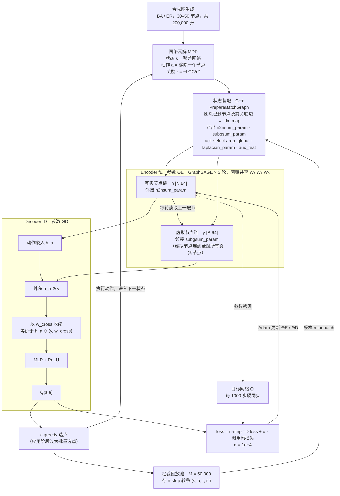
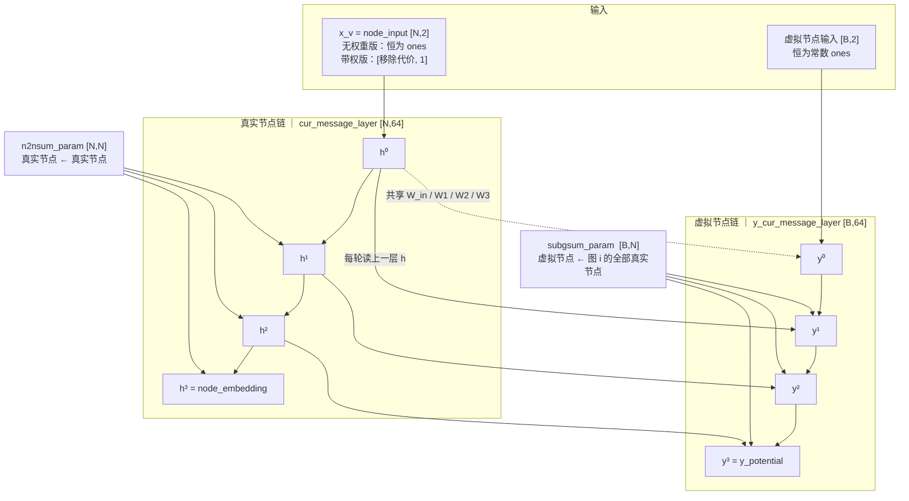
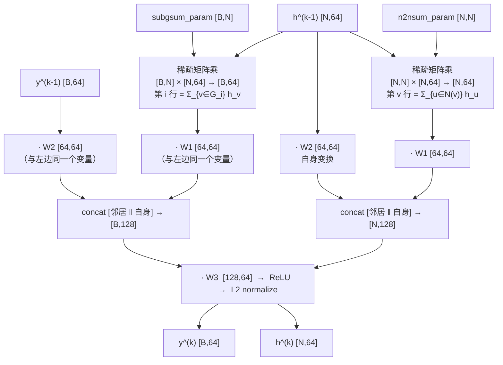
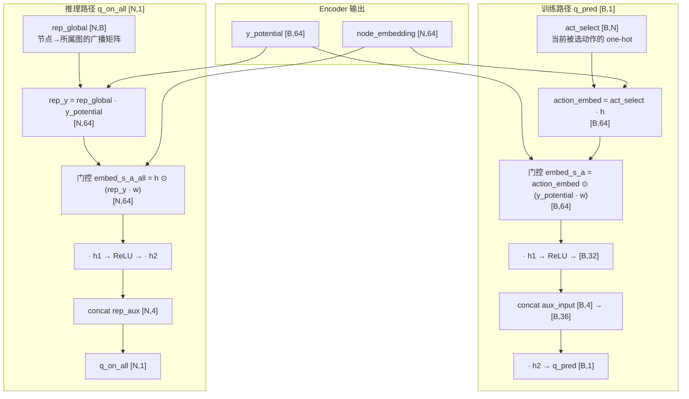
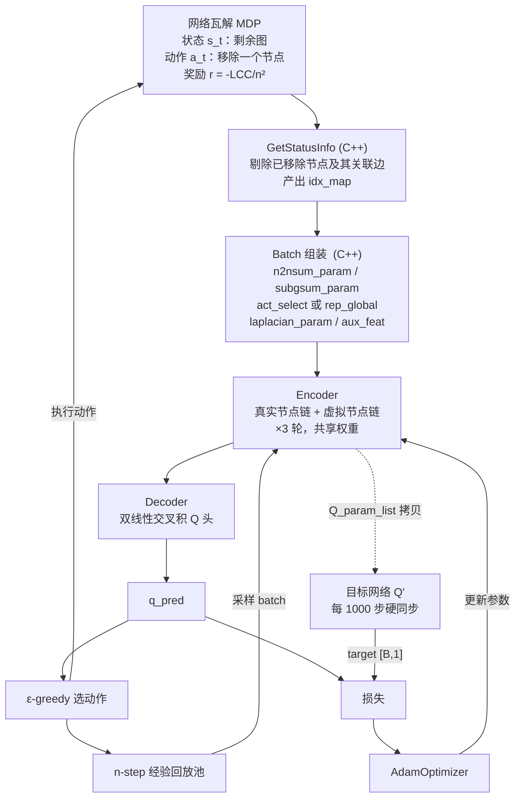
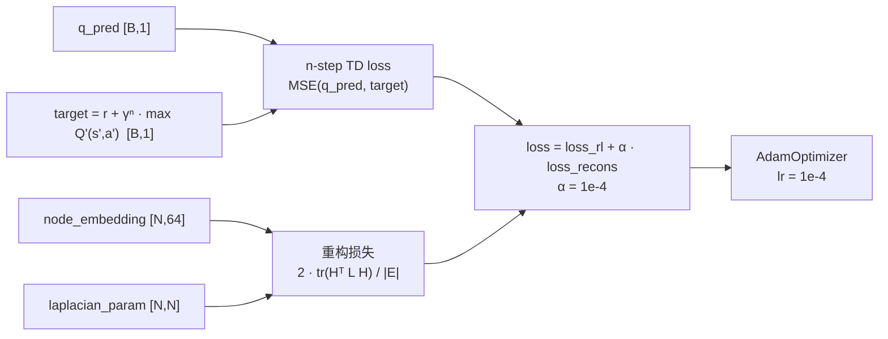

# FINDER 代码架构图解

对照源码：`FINDER/code/FINDER_ND/`（TensorFlow 1.x + Cython）

- 模型定义：`FINDER.pyx:141-332`
- 图与稀疏矩阵构造：`src/lib/PrepareBatchGraph.cpp`
- 图存储结构：`src/lib/graph_struct.h`、`graph_struct.cpp`

约定：`N` = batch 内所有图的节点总数（拼成一张大图后），`B` = batch 里的图数，`D` = 嵌入维度 64。

---

## 论文精读 — Motivation · Insight · Contribution

> **一句话**：网络瓦解的最优决策是**局部的、尺度无关的**——所以可以在玩具图上学会，再直接迁移到百万级真实网络。

### 1 · Motivation：缺口是"知识不可迁移"

**要紧在哪（Stakes）**：在复杂网络中找关键节点是一个长期问题，且横跨完全不相干的领域——反恐网络抓捕、药物设计、灾后交通调度、疫情免疫。

**缺口 + 诊断（原文三连击，附译文）**：

> ① *"Finding an optimal set of key players in general graphs that optimizes nontrivial and hereditary connectivity measures is typically NP-hard. This prohibits exact and scalable solutions of such problems for large-scale networks."*
> → 在一般图上，针对非平凡且具有遗传性质的连通性度量，寻找一组最优关键节点**通常是 NP-hard 问题**；这使此类问题在大规模网络上**无法获得精确且可扩展的解**。
>
> ② *"Traditional heuristic or approximate algorithms either require substantial problem-specific search or suffer from deteriorated performances. It is often hard to provide a satisfying balance between effectiveness and efficiency."*
> → 传统启发式或近似算法**要么需要大量针对具体问题的搜索，要么性能显著退化**，往往**难以在效果与效率之间取得令人满意的平衡**。
>
> ③ *"Moreover, most existing methods are ad hoc for specific application scenarios. Those designed for one particular application often fail on many other applications."*
> → 此外，大多数现有方法都是针对特定应用场景**量身定制（ad hoc）**的——**为某一应用设计的方法，换到其他应用上往往就失效**。

**诊断的递进**（这一段决定了它是高成色的 motivation）：

| | 缺陷类型 | 后果 |
|---|---|---|
| ① | 复杂度 | 精确解不可行、不可规模化 |
| ② | 权衡 | 快与好不可兼得 |
| ③ | **认识论** | **学到的东西不可迁移** |

前两条是工程缺陷，第三条是**结构缺陷**——而它恰好杀死了上面列出的"跨领域应用"：为反恐调好的方法，拿去防疫就不行。

→ **缺口 ＝ 关键节点识别的知识无法跨网络、跨规模复用。**

### 2 · Insight：桥是"这条知识本来就该可迁移"

> **一个节点该不该被移除，取决于它在残余图中 K 跳邻域的结构角色，而不取决于网络的全局规模或全局拓扑。**

- **非显然**：网络科学几十年默认关键节点是**全局属性**（介数中心性、谱方法都要求全图信息）。
- **可迁移的来源**：代码把初始节点特征写成常数 `ones`（`FINDER.pyx:175`），表示里**不含任何与规模相关的量**，节点身份完全由局部结构生成。
- **支撑机制**（论文未说透，来自代码 + 消融）：在"节点无特征"的设定下，structure2vec 的相加式 COM 退化成常数偏置（`W₁·X_v`，而 `X_v ≡ 1`），节点被邻居同化；只有 **GraphSAGE 的拼接式 COM** 显式保留了节点自身的上一层状态。`No-GraphSAGE` 消融在 Enron 上 ANC 从 **2.03 崩到 33.04**，是贡献最大的单项。

→ **桥搭好了：决策既然是局部规则，就能在一个分布上学、在任意分布上用。**

### 3 · Contribution：留下了什么

- **方法**：把 ANC 最小化写成 MDP（状态＝残余网络，动作＝移除节点，奖励＝ANC 下降），用 GNN + n-step DQN 求解；含四个组件——虚拟节点、双线性门控 decoder、图重构损失、批量移除策略
- **复杂度**：`O(|E| + |V| + |V|log|V|)`，可处理百万级网络
- **实证**：30–50 节点合成图训练 → 10³–10⁶ 节点真实网络测试，**跨 4–5 个数量级无微调**；9 个真实网络上解质量与时间效率**双双超越**手工启发式与近似算法；消融显示四组件均有效，**GraphSAGE 式拼接贡献最大**
- **对领域的意义**（论文原话）：*"…suggests a new promising perspective to understand the organizing principles of complex networked systems."*——即**复杂网络的"关键节点"结构，比此前认为的更局部、更可编码**

### 三者串成一条链

```
Motivation   跨领域应用都重要，但现有方法 ad hoc，知识不可迁移
     ↓ 根因：默认关键节点是全局属性 → 只能"一问题一算法"
Insight      关键节点决策其实是局部的、尺度无关的 → 知识天然可迁移
     ↓ 兑现
Contribution 用 GNN+RL 学这条局部规则；玩具图训练，直接迁移到百万级网络并超越全局启发式
     ↓ 反过来验证
             跨 4–5 个数量级的迁移成功，正是"局部性"这条判断最有力的证据
```

**两端各自独立，说明不是包装**：删掉 Insight，Motivation 仍立得住（缺口真实存在）；删掉 Motivation，Insight 仍有意义（可迁移到其他图优化问题）。

**一处保留**：论文称 decoder 用外积是为了"建模更精细的 state-action 交互"，但展开后 state 的交互作用可化为**一个标量** α_s：`Q(s,a) = α_s·φ(h_a) + β_s`。设计有效（消融已证），但论文给出的机制解释不成立。

---

## 总览 — 论文框架 × 代码实现

论文 Fig. 3 / Methods 把框架分成两个阶段：

- **阶段一 离线训练**：在合成图上自训练，200,000 张 30–50 节点的 BA/ER 图，学出编码器 ΘE 与解码器 ΘD
- **阶段二 真实网络应用**：把训好的 agent 直接用到真实网络，改用 "batch nodes selection" 一次移除一批点



论文术语与代码的对应：

| 论文 | 代码 |
|---|---|
| 编码器 fE / 参数 ΘE | `FINDER.pyx:176-251` |
| 解码器 fD / 参数 ΘD | `FINDER.pyx:253-278`、`:301-330` |
| 虚拟节点 | `y_cur_message_layer`，邻接为 `subgsum_param` |
| 状态 s（残差网络） | `GetStatusInfo` 剔除已删节点后的子图 |
| 奖励 r（ANC 下降量） | `src/lib/mvc_env.cpp` |
| 回放池 M = 50,000 | `MEMORY_SIZE`，`FINDER.pyx:31`（代码为 500,000，论文写 50,000，不一致） |
| n-step Q-learning 损失 | `FINDER.pyx:285-295` |
| 图重构损失 | `FINDER.pyx:281-283` |

**一处与论文描述有出入的地方**：论文 Methods 说解码是"外积 + MLP 映射为标量"，代码在外积之后先用 `cross_product [64,1]` 收缩了一次（`FINDER.pyx:258-262`），把 `[B,64,64]` 压回 `[B,64]` 再送进 MLP。展开后等价于

$$Q(s,a) = f\big(h_a \odot \langle y,\ w_{cross}\rangle\big)$$

也就是一个**双线性门控**，而非完整外积的 MLP。真按论文字面做，输入维度会是 64×64 = 4096，参数和显存都不可行。

---

## 图 1 — Encoder：两条并行传播链



两个要点：

- 虚拟节点的邻接是 `subgsum_param` 而非 `n2nsum_param`，所以它收得到全图，真实节点收不到它（单向汇聚）。
- `y³` 读的是 `h²`，虚拟节点永远滞后真实节点一层。

---

## 图 2 — Encoder 单轮：算子与张量形状



对照 `FINDER.pyx:209-246`。三个容易记错的点：

- 聚合是**求和**（`aggregatorID = 0`），不是平均。
- **拼接前**邻居和自身各乘了 W1、W2，不是先拼接再乘一个 W。
- 拼接顺序是 `[邻居 ‖ 自身]`。

末尾的 L2 归一化是 FINDER 加的（`FINDER.pyx:245-246`），GraphSAGE 原版没有。

完整公式：

$$h_v^{(k)} = \mathrm{L2}\Big(\mathrm{ReLU}\big(\big[\textstyle\sum_{u \in \mathcal{N}(v)} h_u^{(k-1)}W_1 \;\|\; h_v^{(k-1)}W_2\big]W_3\big)\Big)$$

$$y_i^{(k)} = \mathrm{L2}\Big(\mathrm{ReLU}\big(\big[\textstyle\sum_{v \in G_i} h_v^{(k-1)}W_1 \;\|\; y_i^{(k-1)}W_2\big]W_3\big)\Big)$$

两者只差求和下标，$W_1, W_2 \in \mathbb{R}^{64\times64}$、$W_3 \in \mathbb{R}^{128\times64}$ 逐字共享。

---

## 图 3 — Decoder：Q 值两条路径



对照 `FINDER.pyx:253-278`（训练）和 `:301-330`（推理）。核心是双线性门控，展开后就是一个**标量**乘以动作嵌入：

$$Q(s,a) = f\big(h_a \odot \langle y,\ w_{cross}\rangle\big)$$

`w_cross` 即 `FINDER.pyx:173` 的 `cross_product [64,1]`。训练时只需被选动作那一行（`act_select`）；推理时用 `rep_global` 把虚拟节点嵌入广播给每个节点，一次算完所有候选动作。

---

## 图 4 — 整体架构：训练闭环



对照 `FINDER.pyx:119-126`（Q 网络与目标网络，`BuildNet` 调了两次）、`:395-426`（`Run_simulator` / `PlayGame`）。

注意 encoder 和 decoder 是**同一张计算图里的两段**——`BuildNet` 一次返回 `loss, trainStep, q_pred, q_on_all, trainable_variables`。

---

## 图 5 — 损失函数



对照 `FINDER.pyx:281-299`。这里的 Laplacian 是 $L = D - A$：对角线是度数、非对角线是 -1（`PrepareBatchGraph.cpp:236-283`）。

$H^\top L H$ 展开后正比于 $\sum_{(u,v)\in E}\|h_u - h_v\|^2$，即逼着**有边相连的节点嵌入互相靠近**。这一项只作用于 `node_embedding`，虚拟节点不参与。

---

## 汇总表

| 阶段 | 代码位置 | 输入 → 输出 |
|---|---|---|
| 状态构造 | `PrepareBatchGraph.cpp:36-93` | 剩余图 → `idx_map` |
| Batch 组装 | `PrepareBatchGraph.cpp:95-202` | → 4 个稀疏矩阵 + aux |
| Encoder | `FINDER.pyx:176-251` | `[N,2]` / `[B,2]` → `[N,64]` / `[B,64]` |
| Decoder | `FINDER.pyx:253-278` / `:301-330` | 嵌入 → `[B,1]` / `[N,1]` |
| 损失 | `FINDER.pyx:281-299` | → 标量 loss |

---

## 关键常量

| 常量 | 值 | 位置 |
|---|---|---|
| `EMBEDDING_SIZE` | 64 | `FINDER.pyx:28` |
| `max_bp_iter` | 3 | `FINDER.pyx:51` |
| `aggregatorID` | 0（sum） | `FINDER.pyx:52` |
| `embeddingMethod` | 1（graphsage） | `FINDER.pyx:53` |
| `N_STEP` | 5 | `FINDER.pyx:40` |
| `BATCH_SIZE` | 64 | `FINDER.pyx:44` |
| `REG_HIDDEN` | 32 | `FINDER.pyx:43` |
| `aux_dim` | 4 | `FINDER.pyx:47` |
| `Alpha` | 1e-4 | `FINDER.pyx:32` |
