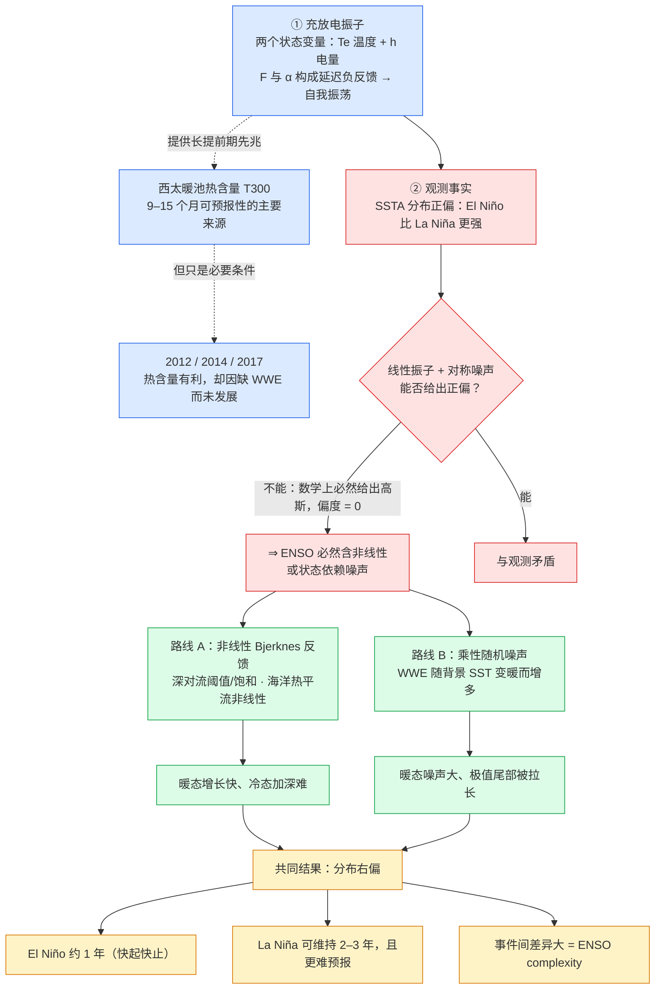
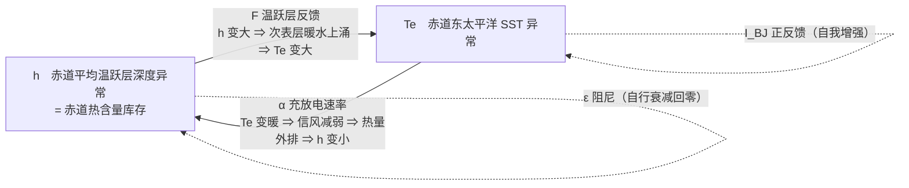
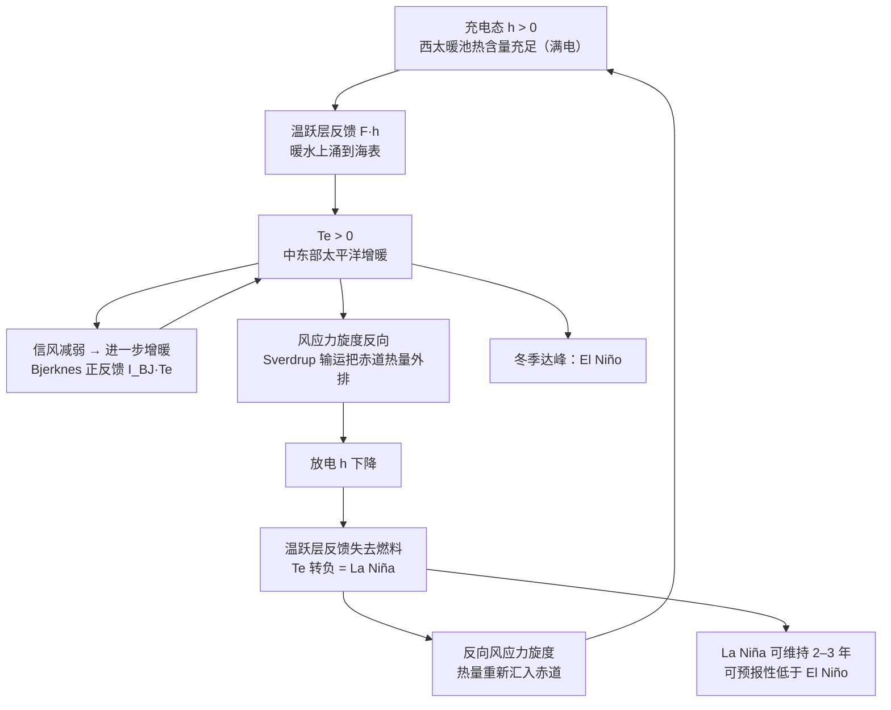

# ENSO 充放电振子 → 正偏态 → 两种机制（Mermaid 源码）

> 用法：把下面的代码块贴到任何支持 Mermaid 的地方即可出图
> （飞书文档 / Typora / Obsidian / GitHub / mermaid.live）。
> 也可以直接看同目录下的 `enso_oscillator_logic_chain.png`（已渲染好的静态图）。

## 主图：完整逻辑链

## 细节图 1：振子的内部结构（Eq. 1）

## 细节图 2：一次完整事件（一个充放电周期）

## 一句话总结

> 海洋记忆给了 ENSO 预报的**可能性**，状态依赖的非线性与噪声给了它的**上限**。
