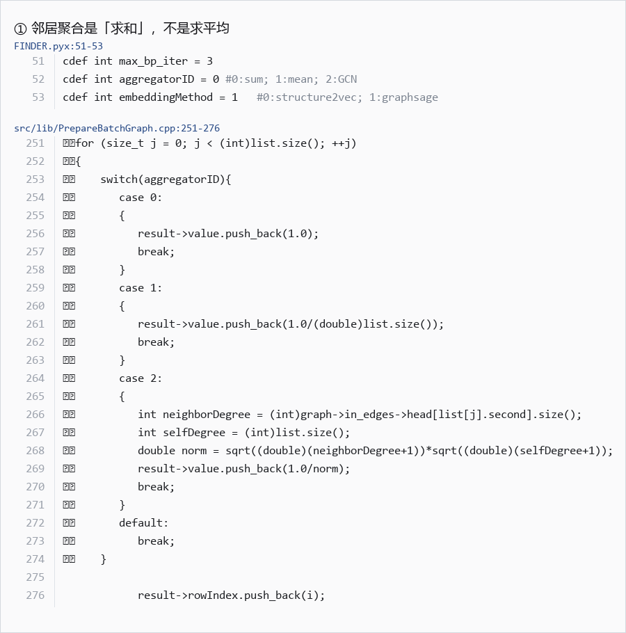
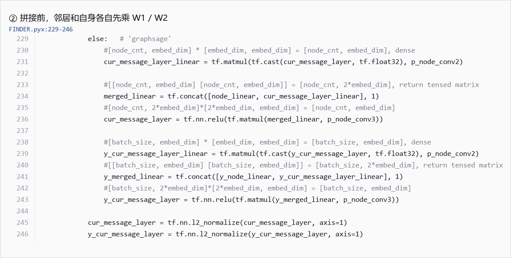
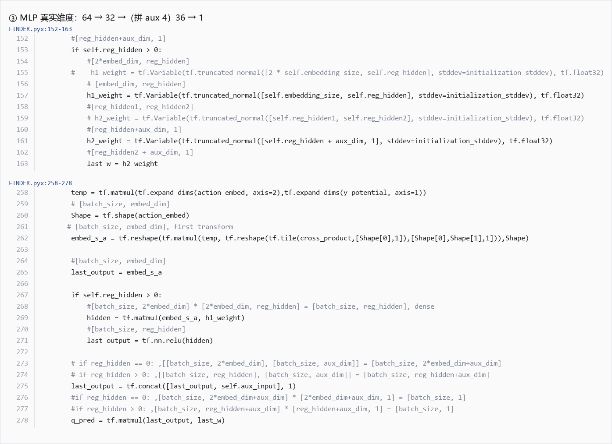
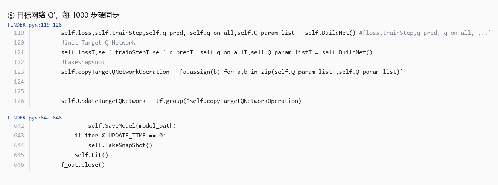
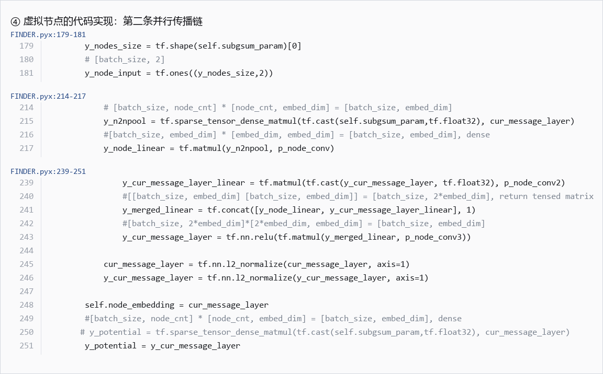
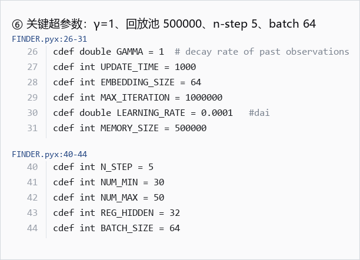
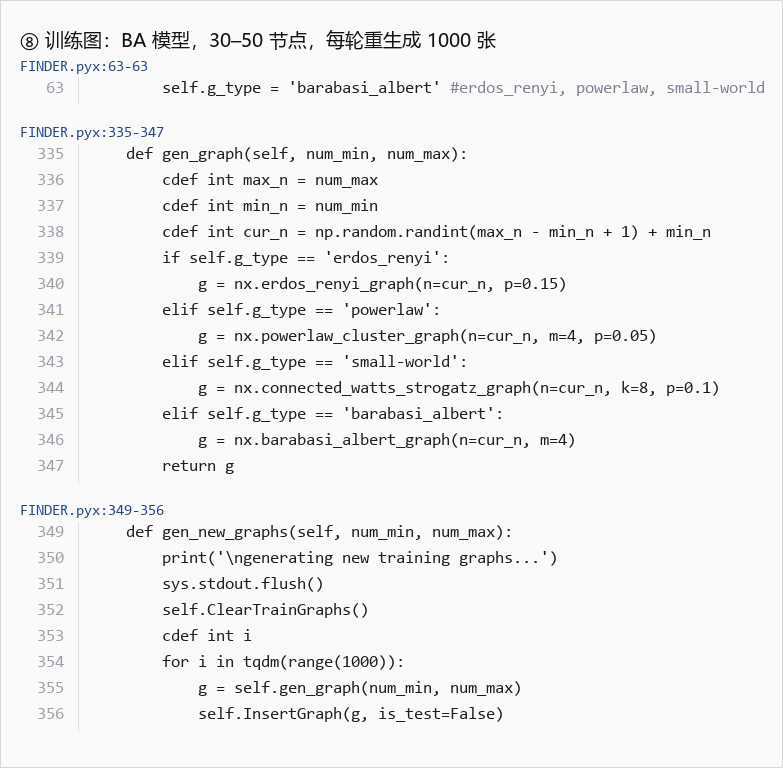
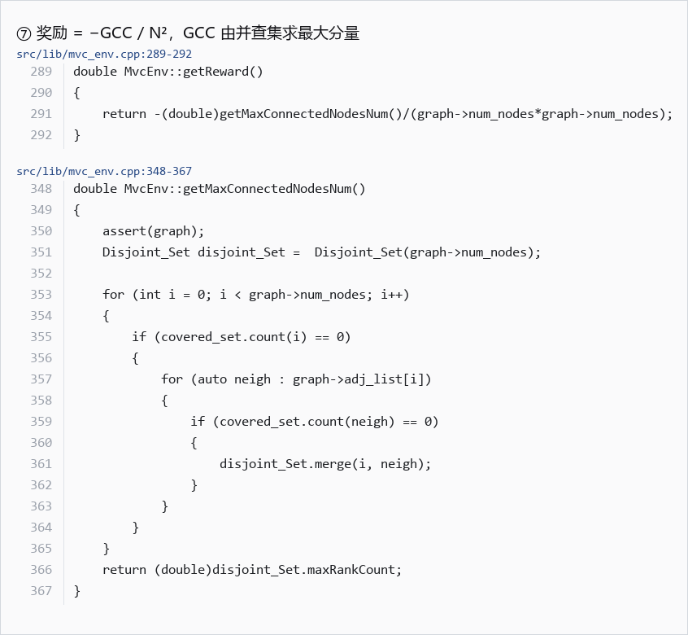

# Week2 笔记待修复清单

针对飞书文档《Week2 Finder》的审阅结果，按优先级排列。
代码位置均指向 `FINDER/code/FINDER_ND/`，📷 标记的条目配有代码截图（`代码截图/` 目录）。

---

## P0 · 理解错误，必须改

- [ ] **1. 邻居聚合是「求和」，不是「求平均」**
  - 笔记原文：「聚合邻居的 H0，**可能是通过求平均值之类的方法**得到 H0'」
  - 正确：`aggregatorID = 0` 走 sum 分支，权重恒为 `1.0`，不做度数归一化。mean 是 `aggregatorID = 1`，代码里有但**没启用**。因为用的是求和，度数高的节点聚合值量级更大，下一层才必须做 L2 归一化。
  - 代码：`FINDER.pyx:51-53`、`src/lib/PrepareBatchGraph.cpp:251-276`

  

- [ ] **2. 拼接前，邻居和自身各自先乘权重**
  - 笔记原文：「然后拼接起来，得到一个新的向量，接着（乘以权重矩阵 W + 激活函数）」
  - 正确：**拼接之前**两边各自先乘自己的矩阵，不是先拼再乘一个 W。且拼接顺序是 `[邻居 ‖ 自身]`。
    ```
    邻居聚合 · W1  ‖  自身 · W2   →  concat  →  · W3  →  ReLU  →  L2 归一化
    ```
  - 代码：`FINDER.pyx:229-246`

  

- [ ] **3. MLP 维度写错了**
  - 笔记原文：「一开始输入一个向量，然后过几层全连接层（**4096 -> 128 -> 64 -> 1**）」
  - 正确：这是照论文「外积 + MLP」字面推的。代码**没有把 64×64 展平**——外积之后先用 `cross_product [64,1]` 收缩回 64 维，实际是：
    ```
    64 →(h1) 32 →(拼 aux 4) 36 →(h2) 1
    ```
    `REG_HIDDEN = 32`，不是 128。真按 4096 做，参数量撑不住。
  - 代码：`FINDER.pyx:152-163`（权重形状）、`FINDER.pyx:258-278`（前向）

  

- [ ] **4. 「全连接神经网络」这个概念混了**（无截图，概念纠正）
  - 笔记原文：「全连接神经网络？当前层和下层的每一个节点都是相连的」
  - 这里把三件不同的东西混在了一起：

    | | 连接关系 | 是否全连接 |
    |---|---|---|
    | **邻居聚合** | 由邻接矩阵 `n2nsum_param` 决定 | **否**，稀疏，只连有边的节点 |
    | **特征变换** W1/W2/W3 | 每个节点**各自**乘同一个矩阵 | 不是「节点相连」，是**权重共享** |
    | **虚拟节点** | 邻接是 `subgsum_param`，连到全图所有真实节点 | 这一条**确实接近全连接**，但只有 B 个且单向 |

  - 关键：GNN 的连接由**图的边**决定，不是全连接。全连接就退化成 MLP，丢掉结构信息了。

---

## P1 · 架构图缺失

- [ ] **5. 目标网络 Q′ 完全没画**（最要紧的一项）
  - `BuildNet()` 被调用两次，一份给 Q 网络、一份给目标网络；每 `UPDATE_TIME = 1000` 步硬同步一次。
  - 没有它，架构图里的 `max Q_next` 就没有来源，DQN 也不会稳定。
  - 代码：`FINDER.pyx:119-126`、`FINDER.pyx:642-646`

  

- [ ] **6. Encoder 只画了一条链**
  - 实际是两条：真实节点链 `[N,64]` + 虚拟节点链 `[B,64]`，共享 W1/W2/W3，同步迭代三轮。
  - 笔记在 decoder 那节写了「来自虚拟节点」，说明概念知道，但架构图没体现。
  - 代码：`FINDER.pyx:179-181`、`:214-217`、`:239-251`

  

- [ ] **7. 回放池存的不是单步四元组**
  - 笔记原文：`(S_t, A_t, R_t, S_t+1)`
  - 正确：是 **n-step** 四元组 `(S_i, A_i, R_{i,i+n}, S_{i+n})`，`N_STEP = 5`。

- [ ] **8. 折扣因子实际是 γ = 1**
  - 笔记写的是通用的 `Target = R_t + γ · max Q_next`，没错，但要知道代码里 `GAMMA = 1`，没有折扣。
  - 代码：`FINDER.pyx:26`

  

- [ ] **9. 环境部分太粗**
  - 笔记只写了「小型合成网络 BA 模型」。可补：BA 模型（`g_type = 'barabasi_albert'`）、30–50 节点、每 5000 轮重新生成 1000 张、ε 从 1.0 线性降到 0.05（前 10000 步内）。
  - 代码：`FINDER.pyx:63`、`:335-347`、`:349-356`

  

---

## P2 · 定义不精确

- [ ] **10. GCC 定义去掉「多次映射」**
  - 笔记原文：「GCC：最大的联通分量（**多次映射之后得到最终的网络？**）」
  - 正确：`σ_gcc(G) = max δᵢ`，就是**当前残差图里最大连通分量的节点数**，用并查集求，没有「多次映射」这回事。
  - 代码：`src/lib/mvc_env.cpp:348-367`

- [ ] **11. 奖励不是「连通性下降量」**
  - 笔记原文：「获取即时奖励 R_t **网络连通性下降量**」
  - 正确：代码里是 `r = −GCC / N²`，即当前连通性的**绝对值取负**，不是相邻两步的差值。（累计后对应论文的 ANC 曲线下面积，优化目标一致。）
  - 代码：`src/lib/mvc_env.cpp:289-292`

  

- [ ] **12. 回放池大小：代码与论文不一致**
  - 代码 `MEMORY_SIZE = 500000`，论文写 `M = 50,000`。引用时注意区分。

- [ ] **13. 「非平凡且遗传」的定位要说准**
  - 它是 **NP-hard 结论的前提条件**，不是某种新的度量类型。
  - FINDER 用的 σ_pair 和 σ_gcc 本身都满足它。违反条件的反例：连通分量个数（非平凡性不成立）、「图是连通的」（非遗传）。

---

## P3 · 只提了问题、还没回答

- [ ] **14. 为什么要用 decoder？** —— 标题问了两个，笔记只答了 encoder
  - 提示：encoder 描述「节点在结构中的位置」，与具体决策无关；decoder 回答「在这个状态下移除它值不值」。虚拟节点提供的全局信息必须通过 decoder 注入到每个动作的打分里，否则没有地方做 state-action 交互。
- [ ] **15. 什么是 GraphSAGE** —— 只有截图，没有文字
- [ ] **16. 如何生成向量** —— 只有截图，没有文字
- [ ] **17. 权重 VS 超参数** —— 只有截图，没有文字

---

## P4 · 文档形式问题

- [ ] **18. 10 处 `image.png` 旁边没有文字说明**
  - 位置：小型合成网络是什么 · 权重 VS 超参数 · 非平凡和遗传性质 · 如何生成向量 · Finder 是怎么学习的（×2）· 什么是 graphsage · encoder 末尾 · 什么是 L2 归一化 · 什么是外积
  - 飞书文本接口不返回图片内容，这些节等于「只有图、没有观点」。复习时无从查起，建议每张图旁补一句话。

---

## 已确认改对的部分

- H0 = `[1，1]`（原 `[3，0.2]`）
- 「实际代码中跳了三层」= `max_bp_iter = 3`
- 虚拟节点 = 全局状态向量的概念
- 外积的定义、L2 归一化的定义
